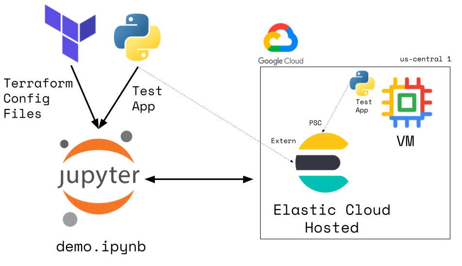

# Elastic/Private Service Connect w/Terraform
## Contents
1.  [Summary](#summary)
2.  [Architecture](#architecture)
3.  [Features](#features)
4.  [Prerequisites](#prerequisites)
5.  [Installation](#installation)
6.  [Usage](#usage)

## Summary 
This is a demonstration of using Terraform to build an Elastic Cloud Hosted (ECH) with Google Cloud Platform (GCP) Private Service Connect (PCS)
## Architecture 
 

## Features 
- Jupyter notebook
- Builds an ECH deployment via Terraform
- Configures GCP PCS to that deployment via Terraform
- Deploys a GCP test VM to the same region/subnet as PCS
- Deploys a Python latency test app to that VM
- Performs latency tests that compare external vs PCS access to the ECH deployment
- Deletes the entire deployment via Terraform

## Prerequisites 
- terraform
- Elastic Cloud account and API key
- GCP project
- gcloud CLI
- Python

## Installation 
- Edit the terraform.tfvars.sample and rename to terraform.tfvars
- Create a Python virtual environment

## Usage 
- Execute notebook