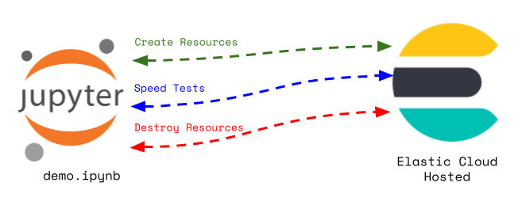

# Elastic/GCP Private Service Connect Integration
I cover deployment of [Elastic Cloud Hosted (ECH)](https://www.elastic.co/cloud/) and [Google Cloud Platform (GCP)](https://cloud.google.com/?hl=en) [Private Service Connect (PSC)](https://docs.cloud.google.com/vpc/docs/private-service-connect) via [Terraform](https://developer.hashicorp.com/terraform) in this article.  The following areas are covered:
- Deployment of an ECH cluster on GCP via Terraform
- Creation of a PSC endpoint to that cluster via Terraform
- Creation of a test VM on GCP via Terraform
- Deployment and execution of a minimal latency testing Python app against the external and PSC connections to ECH  

PSC enables the connection of existing GCP services to ECH, keeping that traffic on the Google backbone.  Internet egress is avoided.  There are performance and cost benefits from the use of PSC.

# Architecture

## High Level
This demo is built in a Jupyter notebook.  Terraform is leveraged for all infrastructure build and teardown.  A simple Python app for measuring latency is built using the official [Elastic Python client](https://www.elastic.co/docs/reference/elasticsearch/clients/python)


 

## Application Flow
The diagram below depicts the application flow in the notebook.



# Code Samples

## ECH Cluster Build
- [Elastic Cloud deployment](https://registry.terraform.io/providers/elastic/ec/latest/docs/resources/deployment)
- [Elastic Stack provider](https://registry.terraform.io/providers/elastic/elasticstack/latest/docs/guides/elasticstack-and-cloud)
- [Elasticsearch index](https://registry.terraform.io/providers/elastic/elasticstack/latest/docs/resources/elasticsearch_index)
```hcl
data "ec_stack" "elastic_latest" {
  version_regex = "latest"
  region        = "gcp-${var.region}"
}

resource "ec_deployment" "primary" {
  region                 = "gcp-${var.region}"
  name                   = "primary_cluster"
  version                = data.ec_stack.elastic_latest.version
  deployment_template_id = var.deployment_template_id

  elasticsearch = {
    hot = {
      autoscaling = {}
    }
  }

  kibana = {}
}

provider "elasticstack" {
  elasticsearch {
    endpoints = ["${ec_deployment.primary.elasticsearch.https_endpoint}"]
    username  = ec_deployment.primary.elasticsearch_username
    password  = ec_deployment.primary.elasticsearch_password
  }
  alias = "primary"
}

resource "elasticstack_elasticsearch_index" "test_index" {
  provider = elasticstack.primary
  name = "test-index"

  mappings = jsonencode({
    properties = {
      field_1 = { type = "text" }
      field_2 = { type = "text" }
      field_3 = { type = "text" }
      field_4 = { type = "text" }
      field_5 = { type = "text" }
      field_6 = { type = "text" }
      field_7 = { type = "text" }
      field_8 = { type = "text" }
      field_9 = { type = "text" }
      field_10 = { type = "text" }
    }
  })

  deletion_protection = false
  number_of_shards   = 1
  number_of_replicas = 1
  search_idle_after  = "20s"
}
```

## PSC Provisioning (abbrev)
[GCP Forwarding Rule](https://registry.terraform.io/providers/hashicorp/google/latest/docs/resources/compute_forwarding_rule)  
[Elastic documentation](https://www.elastic.co/docs/deploy-manage/security/private-connectivity-gcp)
```hcl
resource "google_compute_forwarding_rule" "psc_forwarding_rule" {
  name                  = "psc-forwarding-rule"
  region                = var.region
  project               = var.project_id
  network               = google_compute_network.psc_vpc.id
  ip_address            = google_compute_address.psc_endpoint.id
  load_balancing_scheme = ""
  target                = var.elastic_central_psc_service_attachment
}
```

## VM Provisioning
[GCP Compute Instance](https://registry.terraform.io/providers/hashicorp/google/latest/docs/resources/compute_instance)
```hcl
resource "google_compute_instance" "central_vm" {
  name         = "central-vm"
  machine_type = "e2-medium"
  zone         = var.zone
  project      = var.project_id
  
  tags = ["allow-ssh"]
  
  boot_disk {
    initialize_params {
      # Ubuntu 24.04 LTS
      image = "ubuntu-os-cloud/ubuntu-2404-lts-amd64"
      size  = 20
      type  = "pd-standard"
    }
  }
  
  network_interface {
    subnetwork = google_compute_subnetwork.psc_subnet.id
    
    # External IP for SSH access from internet
    access_config {
      # Ephemeral external IP
    }
  }
  
  metadata_startup_script = <<-EOF
    #!/bin/bash
    apt-get update
    apt-get install -y curl wget git vim python3-pip python3-venv
    echo "VM setup complete" > /tmp/startup-complete.txt
  EOF
  
  # Service account with minimal permissions
  service_account {
    scopes = ["cloud-platform"]
  }
  
  # Allow stopping for maintenance
  allow_stopping_for_update = true
}
```

## Application Deployment to VM
```bash
gcloud compute ssh central-vm --zone=us-central1-a --command="mkdir -p speedtest" --no-user-output-enabled && \
gcloud compute scp ./scripts/speed_test.py central-vm:~/speedtest --zone=us-central1-a --no-user-output-enabled && \
gcloud compute scp ./.env central-vm:~/speedtest --zone=us-central1-a --no-user-output-enabled && \
gcloud compute scp ./requirements.txt central-vm:~/speedtest --zone=us-central1-a --no-user-output-enabled && \
gcloud compute ssh central-vm --zone=us-central1-a --command="cd speedtest && python3 -m venv venv && source venv/bin/activate && pip install -q -U -r requirements.txt" --no-user-output-enabled && \
```

# Tests
I include a Python app that does execution timing on 1000 writes and reads.  That app is run from the local environment (laptop) to the external ECH endpoint and from the GCP VM in the same region as ECH to the ECH PSC endpoint.  The results are below.
## External Connection
```bash
*** Write Test ***

Latency Percentiles:
50th:     38.04 ms
95th:     54.59 ms
99th:     94.94 ms

*** Read Test ***

Latency Percentiles:
50th:     33.45 ms
95th:     47.46 ms
99th:     65.41 ms
```

## PSC Connection
```bash
*** Write Test ***

Latency Percentiles:
50th:      8.52 ms
95th:      9.90 ms
99th:     11.52 ms

*** Read Test ***

Latency Percentiles:
50th:      5.31 ms
95th:      8.45 ms
99th:     11.48 ms
```

# Source
https://github.com/joeywhelan/ech-psc